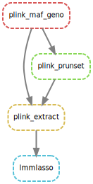

# QRgenomicfiltering

A pipeline deploying snakemake to perform filtering of genomic data files using the tool PLINK 2.0. Input is one or multiple genomic data files at the same time in .bed, .bim, .fam format (PLINK). The directed acyclic graph (DAG) below displays the sequence of steps in the pipeline.

 
 

Each step {parametervalue in Snakefile} :
1.  _plink_maf_geno_ : Takes the original genomic input files in PLINK format. It removes the rare genetic loci, defined with a threshold of the minor allele frequency {MAF}, the loci with a given percentage of missing values {GENO} and checks for Hardy-Weinberg-Equilibrium (hwe=0.00001) and outputs the processed genomic files.
2.  _plink_prunset_ : Takes the processed genomic files and calculates the LD disequilibrium between genetic loci with a threshold R {PRUNELD}
3.  _plink_extract_ : Takes the processed genomic files and extracts the loci in LD disequilibrium calculated in plink_prunset
4.  _lmmlasso_ TO BE SKIPPED OR ALTERED : Used to perform phenotype trait prediction based on the genotype, coupled to a tool which is to be publically available soon.

More information on the functionalities of PLINK 2.0 are available directly on the website https://www.cog-genomics.org/plink/2.0

# RUN

If to include the last step  _lmmlasso_ , set up the conda environment using the provided newpy3.yaml file.

Execute the command: snakemake --cores 6 --use-conda /resultdir/samples_height_withconf_pr0.5.pdf
